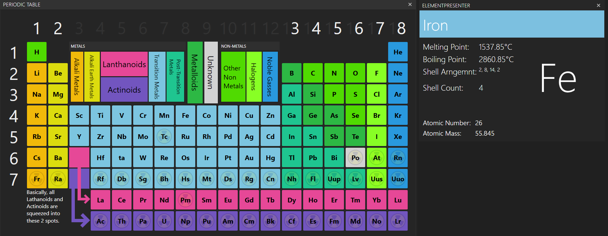

# Periodic Table in C#
 made using C# and WPF as it's UI features are very nice. and because it would be easier than anything else.
## Latest update

## For if you know a bit about C# and WPF
 the program works by using Button commands and command parameters. the parameters are the symbols of the elements, 
 so if you change the iron button's command parameter to Cu, it'll basically be like clicking copper, not iron.
 All the buttons run the same command also, and that command in binded to the MainViewModel.cs file. you'll see
 that it fires the method Update(object elementName). that method creates a new Element class which contains a bunch of
 things like Element name, symbol, melting, boiling points, shells, electron config, etc. 
 ElementNameMatcher is a static class that turns the symbols (Fe, Na, U, etc) into an Element class (by fetching it from the
 StaticElementHolder, which is what holds the actual elements and their details like what i said before; melting point, shells, etc).
 That window that displays the extra information is called the ElementPresenter; all of it's information (like numbers, text and even the 
 radioactive image) is binded to the names of all the things in an Element class. so all you have to do is set the window's datacontext as
 one of those static element classes and it'll automatically set all the info. 
 
 if none of that makes sense, basically; you have an Element class which has some undefined variables inside like element name, symbol, shells, etc.
 You create a new "instance" of that class and give it some values and set an ElementPresenter window's datacontext as that element class. still
 probably makes no sense but eh.

# Running the program
 you should just be able to open the project (the .sln file) and click Start (in visual studios)
 if not, look for the debug folder and looks for the .exe. if that doesn't work the just msg me
 
 # Adding an element
 
 Go into the Elements folder and open the StaticElementHolder. inside you'll see a bunch of stuff i've already added. you can probably see how you
 add elements from there (public static Element Titanium = new Element { inside here add all titanium's stats like melting, boiling point, etc. };)
 Then, goto the ElementFinder folder and open the ElementNameMatcher class. you'll see a switch with elementname inside. dont worry about that, but below
 you'll see stuff like case "Li": (for lithium), case "Ar", etc. if you added titanium, at the bottom:
 case "Ti": return StaticElementHolder.Titanium; (also remeber it has to be the real symbol with caps. no ti ot TI; Ti)
 
 if none of that at all made sense i'll just add it for you. also quick note, some of the elements might have wrong values when i completely broke
 the program once and just added some random values. srry :(
 
> i should also mention, you dont need to mess with anything inside the Views, ViewModels, Units and Resources folders (unless you know what you're doing).
> all of the "showing info in the windows" is done for you, you just need to add the new elements and tell the elementnamematcher where to get it from basically.
